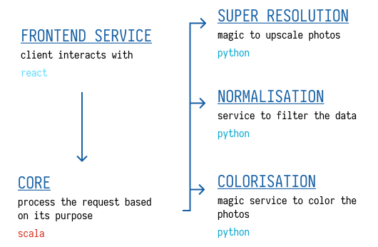

# Photo Crowd

This application was developed during the Open Data Camp 2021 hackathon. The goal of the "Photo Crowd" app is to use the power of people to annotate unknown old images. 

## Deploy

You need to create two empty folders (`colorised` & `upscaled`) inside the 
`photo` folder.

```bash
mkdir -p ./photo/colorised ./photo/upscaled
```

> Note: Upscale will work only if you put upscaled photos in the 
> `/photo/upscaled` folder.

Then just simply start docker:

```bash
docker-compose up
```

Then simply open the [localhost](http://localhost).

## Architecture

A microservice architecture was used for this application. This repository consists of several services, as shown below.



The repositories of each service listed above can be found here: 

- Frontend - [3N/pc-frontend](https://github.com/3N-Company/pc-frontend)
- Core - [3N/pc-core](https://github.com/3N-Company/pc-core)
- Normalisation - [3N/pc-normalisation](https://github.com/3N-Company/normalisation)
- Colorisation - [3N/pc-colorisation](https://github.com/3N-Company/colorisation)
